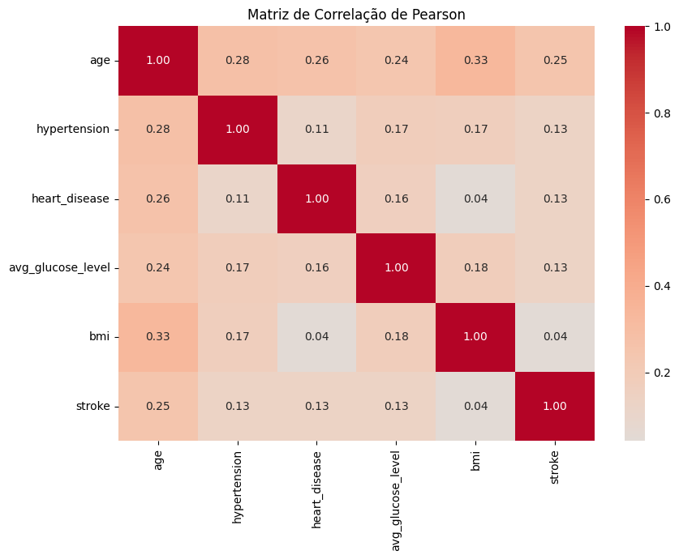
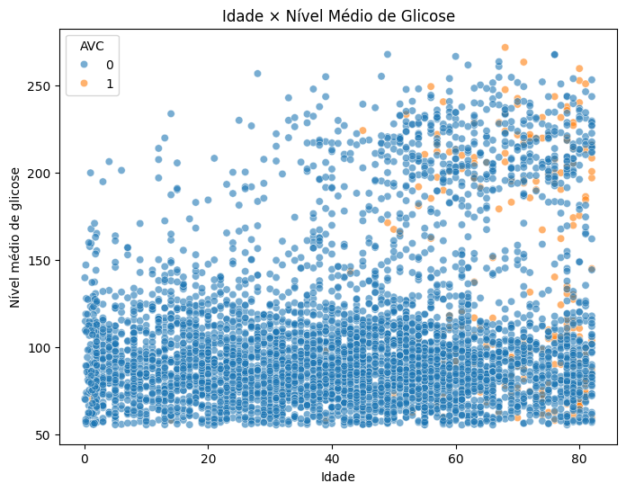
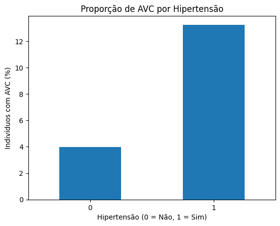
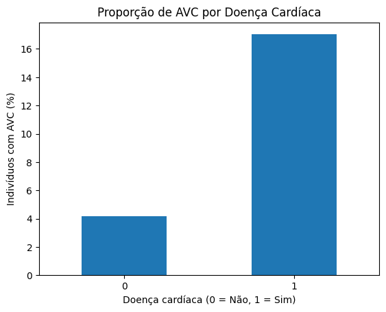
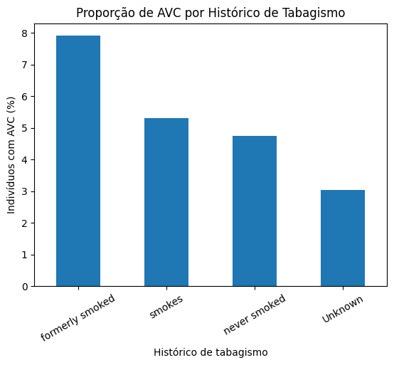
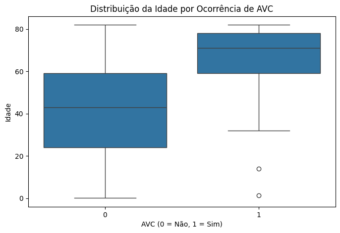
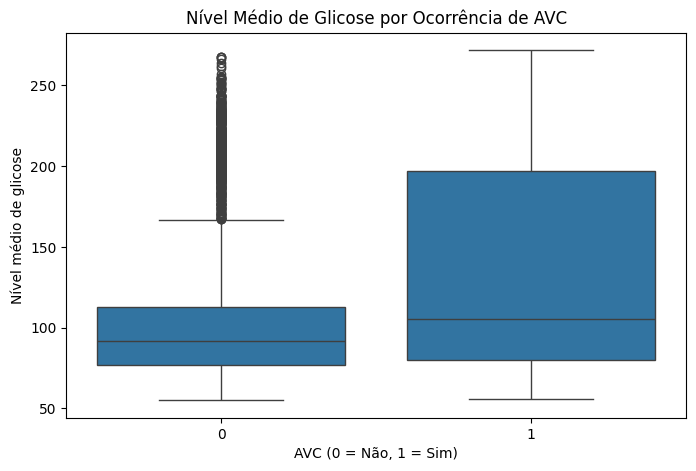

# Análise Bivariada e Multivariada

Nesta etapa, são investigadas as relações entre diferentes variáveis do dataset, com atenção especial às associações com a variável alvo `stroke`.

## 1. Relações entre Variáveis Numéricas

### Matriz de Correlação

Foi utilizada a correlação de Pearson para avaliar a associação linear entre as variáveis numéricas e binárias selecionadas.

A coluna `id` foi excluída por representar apenas um identificador individual.

```python
correlacao = df[
    [
        "age",
        "hypertension",
        "heart_disease",
        "avg_glucose_level",
        "bmi",
        "stroke"
    ]
].corr()

sns.heatmap(
    correlacao,
    annot=True,
    fmt=".2f",
    cmap="coolwarm",
    center=0
)
```



De maneira geral, não foram observadas correlações lineares fortes entre as variáveis analisadas.

Em relação à variável alvo `stroke`, a maior correlação foi observada com `age` (**0,25**). `hypertension`, `heart_disease` e `avg_glucose_level` apresentaram correlações positivas de aproximadamente **0,13**, enquanto `bmi` apresentou correlação próxima de zero (**0,04**).

Esses resultados indicam que nenhuma das variáveis analisadas apresenta, isoladamente, uma forte relação linear com a ocorrência de AVC. Entretanto, correlações baixas não significam necessariamente ausência de capacidade preditiva, pois podem existir relações não lineares e interações entre diferentes características.

### Scatter Plot: Idade e Nível Médio de Glicose

Para complementar a matriz de correlação, foi utilizado um scatter plot relacionando `age` e `avg_glucose_level`, com a variável `stroke` representada pela cor dos pontos.

```python
sns.scatterplot(
    data=df,
    x="age",
    y="avg_glucose_level",
    hue="stroke",
    alpha=0.6
)
```



O gráfico não evidencia uma relação linear forte entre idade e nível médio de glicose, resultado consistente com a correlação relativamente baixa observada entre essas variáveis (**0,24**).

Os casos positivos de AVC aparecem com maior frequência nas faixas etárias mais elevadas. Entretanto, existe grande sobreposição entre indivíduos com e sem AVC, indicando que a combinação dessas duas variáveis, isoladamente, não proporciona uma separação clara entre as classes.

Também é possível observar uma concentração distinta de indivíduos com níveis mais elevados de glicose, comportamento já identificado anteriormente na análise univariada.

## 2. Relações entre Variáveis Categóricas e o Target

Como o dataset escolhido é o **Stroke Prediction Dataset**, a variável alvo utilizada nesta análise é `stroke`.

### Hipertensão e Ocorrência de AVC

Para analisar a relação entre hipertensão e ocorrência de AVC, foi calculada a proporção de indivíduos com `stroke = 1` dentro de cada grupo.

```python
pd.crosstab(
    df["hypertension"],
    df["stroke"],
    normalize="index"
) * 100
```

| Hipertensão | Sem AVC | Com AVC |
|---|---:|---:|
| Não (`0`) | 96,03% | 3,97% |
| Sim (`1`) | 86,75% | 13,25% |

```python
taxa_hipertensao = (
    df.groupby("hypertension")["stroke"].mean() * 100
)

taxa_hipertensao.plot(kind="bar")
```



Entre os indivíduos **sem hipertensão**, aproximadamente **3,97%** tiveram AVC. Já entre os indivíduos **com hipertensão**, essa proporção foi de aproximadamente **13,25%**.

Portanto, no conjunto de dados analisado, a proporção de AVC é mais de três vezes maior entre indivíduos com hipertensão. Esse resultado indica uma associação entre as variáveis, mas não permite estabelecer uma relação de causalidade.

### Doença Cardíaca e Ocorrência de AVC

Também foi analisada a proporção de AVC entre indivíduos com e sem doença cardíaca.

```python
pd.crosstab(
    df["heart_disease"],
    df["stroke"],
    normalize="index"
) * 100
```

| Doença cardíaca | Sem AVC | Com AVC |
|---|---:|---:|
| Não (`0`) | 95,82% | 4,18% |
| Sim (`1`) | 82,97% | 17,03% |

```python
taxa_doenca_cardiaca = (
    df.groupby("heart_disease")["stroke"].mean() * 100
)

taxa_doenca_cardiaca.plot(kind="bar")
```



Entre os indivíduos **sem doença cardíaca**, aproximadamente **4,18%** tiveram AVC. Entre os indivíduos **com doença cardíaca**, essa proporção foi de aproximadamente **17,03%**.

Assim, no conjunto de dados analisado, a proporção observada de AVC é cerca de quatro vezes maior no grupo com doença cardíaca. O resultado evidencia uma associação entre as variáveis, mas não permite estabelecer uma relação causal.

### Histórico de Tabagismo e Ocorrência de AVC

Foi analisada a proporção de indivíduos com AVC dentro de cada categoria de histórico de tabagismo.

```python
pd.crosstab(
    df["smoking_status"],
    df["stroke"],
    normalize="index"
) * 100
```

| Histórico de tabagismo | Sem AVC | Com AVC |
|---|---:|---:|
| `formerly smoked` | 92,09% | 7,91% |
| `smokes` | 94,68% | 5,32% |
| `never smoked` | 95,24% | 4,76% |
| `Unknown` | 96,96% | 3,04% |

```python
taxa_tabagismo = (
    df.groupby("smoking_status")["stroke"]
      .mean()
      .sort_values(ascending=False) * 100
)

taxa_tabagismo.plot(kind="bar")
```



A maior proporção de AVC foi observada entre indivíduos classificados como `formerly smoked`, com aproximadamente **7,91%**. Em seguida aparecem `smokes` (**5,32%**), `never smoked` (**4,76%**) e `Unknown` (**3,04%**).

Essas diferenças indicam uma associação entre o histórico de tabagismo e a frequência de AVC no dataset. Entretanto, não é possível atribuir essas diferenças exclusivamente ao tabagismo, pois outras características dos indivíduos, como idade, podem estar associadas simultaneamente às duas variáveis.

Além disso, a categoria `Unknown` deve ser interpretada com cautela, pois representa indivíduos cujo histórico de tabagismo não é conhecido.

## 3. Relações entre Variáveis Numéricas e Categóricas

Para comparar variáveis quantitativas entre as duas categorias da variável `stroke`, foram utilizados boxplots.

### Idade e Ocorrência de AVC

Como `age` apresentou a maior correlação com a variável alvo, sua distribuição foi comparada entre indivíduos com e sem ocorrência de AVC.

```python
sns.boxplot(
    data=df,
    x="stroke",
    y="age"
)
```



Observa-se uma diferença expressiva na distribuição da idade entre as duas classes. Os indivíduos que tiveram AVC (`stroke = 1`) apresentam idades consideravelmente mais elevadas, com mediana próxima de 70 anos, enquanto a mediana do grupo sem AVC está próxima de 43 anos.

Além disso, a maior parte dos indivíduos com registro de AVC está concentrada em faixas etárias mais altas. Esse resultado reforça a associação positiva observada anteriormente entre `age` e `stroke`.

Apesar dessa associação, o resultado é exploratório e não permite concluir que a idade, isoladamente, determine a ocorrência de AVC.

### Nível de Glicose e Ocorrência de AVC

A distribuição de `avg_glucose_level` também foi comparada entre as classes da variável alvo.

```python
sns.boxplot(
    data=df,
    x="stroke",
    y="avg_glucose_level"
)
```



O grupo com ocorrência de AVC (`stroke = 1`) apresenta maior dispersão nos níveis médios de glicose e uma parcela considerável de observações em valores elevados.

Apesar dessa diferença, existe sobreposição entre as distribuições das duas classes. Portanto, o nível médio de glicose, quando analisado isoladamente, não permite uma separação clara entre indivíduos com e sem ocorrência de AVC.

O resultado é consistente com a correlação positiva, porém fraca, observada entre `avg_glucose_level` e `stroke` (**0,13**).