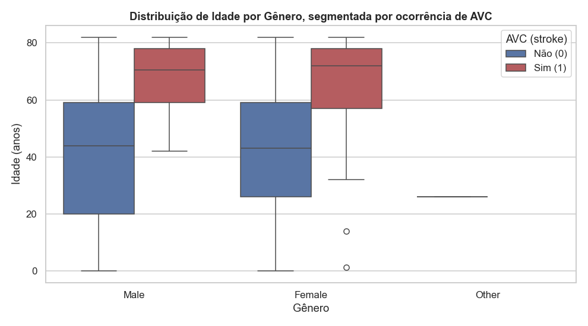
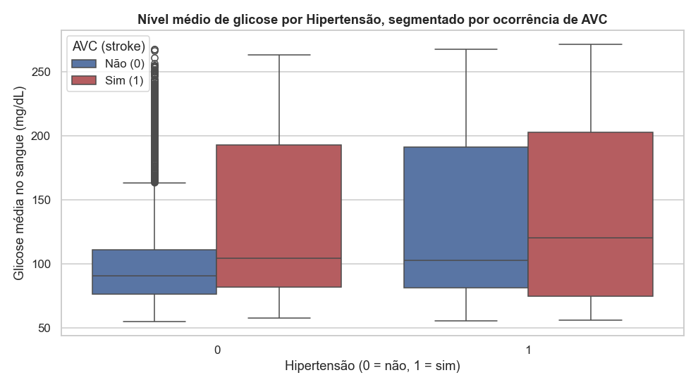
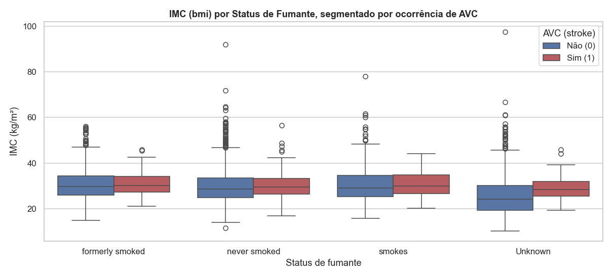
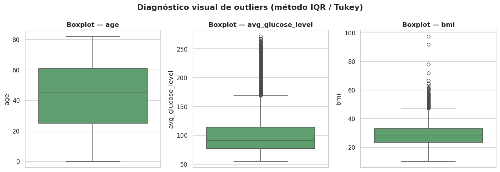

# Análise Multivariada e Diagnóstico de Outliers

Nesta etapa avaliamos como uma variável **numérica** se comporta simultaneamente em função de uma variável **categórica** e do **target** (`stroke`), usando *boxplots* agrupados (`hue`). O objetivo é identificar padrões de risco que só aparecem quando cruzamos três dimensões ao mesmo tempo — por exemplo, será que o efeito da glicemia sobre o risco de AVC é diferente entre hipertensos e não hipertensos?


## Idade × Gênero × AVC

```python
sns.boxplot(
    data=df, x="gender", y="age", hue="stroke",
    palette=["#4C72B0", "#C44E52"]
)
```



Em ambos os gêneros, a mediana de idade dos pacientes que sofreram AVC é visivelmente maior (por volta de 70 anos) do que a dos que não sofreram (por volta de 43 anos), confirmando a idade como o principal fator de risco já identificado na análise bivariada. Não há diferença relevante entre gêneros dentro de cada grupo de `stroke`.

## Glicose × Hipertensão × AVC

```python
sns.boxplot(
    data=df, x="hypertension", y="avg_glucose_level", hue="stroke",
    palette=["#4C72B0", "#C44E52"]
)
```



Pacientes hipertensos apresentam mediana de glicose um pouco mais alta, e em ambos os grupos (hipertensos e não hipertensos) os pacientes com AVC concentram-se em níveis de glicose mais elevados e com maior dispersão — sugerindo um possível efeito combinado (comorbidade) entre hipertensão, hiperglicemia e risco de AVC.

## IMC × Tabagismo × AVC

```python
sns.boxplot(
    data=df, x="smoking_status", y="bmi", hue="stroke",
    palette=["#4C72B0", "#C44E52"]
)
```



As medianas de IMC são semelhantes entre os grupos, mas há bastante dispersão e outliers em todas as categorias. O IMC isoladamente parece ser um preditor mais fraco de `stroke` do que idade e glicose, mas mantém-se relevante como covariável clínica.

Em conjunto, os três gráficos reforçam que o risco de AVC neste dataset resulta de uma combinação de fatores (idade avançada + comorbidades metabólicas), e não de uma única variável isolada — o que motiva o uso de um modelo multivariado na APS2, em vez de regras univariadas simples.

## Diagnóstico Formal de Outliers

Aplicamos o método do **intervalo interquartil (IQR — Tukey, 1977)** às três variáveis numéricas contínuas do dataset (`age`, `avg_glucose_level`, `bmi`). Um valor é considerado outlier se estiver fora do intervalo `[Q1 - 1.5 × IQR, Q3 + 1.5 × IQR]`.

```python
def iqr_outlier_report(series, name):
    q1, q3 = series.quantile(0.25), series.quantile(0.75)
    iqr = q3 - q1
    low, high = q1 - 1.5 * iqr, q3 + 1.5 * iqr
    mask = (series < low) | (series > high)
    return {"variável": name, "Q1": q1, "Q3": q3, "IQR": iqr,
            "limite inferior": low, "limite superior": high,
            "n_outliers": mask.sum(), "% outliers": 100 * mask.sum() / len(series)}
```

| Variável | Q1 | Q3 | IQR | Limite inferior | Limite superior | n outliers | % outliers |
|---|---:|---:|---:|---:|---:|---:|---:|
| `age` | 25.00 | 61.00 | 36.00 | -29.00 | 115.00 | 0 | 0.00% |
| `avg_glucose_level` | 77.24 | 114.09 | 36.84 | 21.98 | 169.36 | 627 | 12.27% |
| `bmi` | 23.50 | 33.10 | 9.60 | 9.10 | 47.50 | 110 | 2.24% |



### Justificativa da estratégia de tratamento de outliers

- **`age`**: não apresenta outliers pelo critério IQR — os valores variam de 0 a 82 anos, faixa fisiologicamente plausível. Nenhum tratamento é necessário.
- **`avg_glucose_level`**: apresenta uma quantidade relevante de outliers superiores (12,27%). Do ponto de vista clínico, glicemias elevadas (>150–200 mg/dL) são esperadas em pacientes diabéticos ou pré-diabéticos e são justamente um dos fatores associados a maior risco de AVC — ou seja, **não são erros de medição, e sim sinal informativo**. Removê-los descartaria exatamente os casos de maior risco.
- **`bmi`**: também apresenta outliers superiores (2,24%), em geral condizentes com obesidade severa, o que é plausível clinicamente, embora valores extremos (ex.: IMC > 60) sejam raros e possam conter algum erro de digitação/medição.

**Decisão adotada:** optamos por **não remover** nenhuma instância por outliers — remover pacientes com valores extremos de glicose/IMC enviesaria o dataset justamente contra os casos de maior risco de AVC, que já é a classe minoritária (~4,9%). Em vez disso, o tratamento de outliers é feito via **transformação de escala** (padronização, ver [Pipeline de Pré-processamento](pipeline.md)), e não via remoção de linhas, preservando o tamanho da amostra e a informação clínica relevante.
