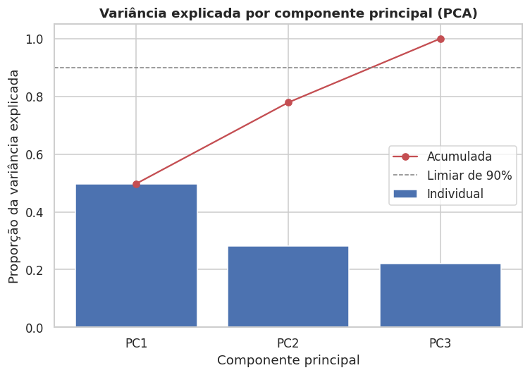
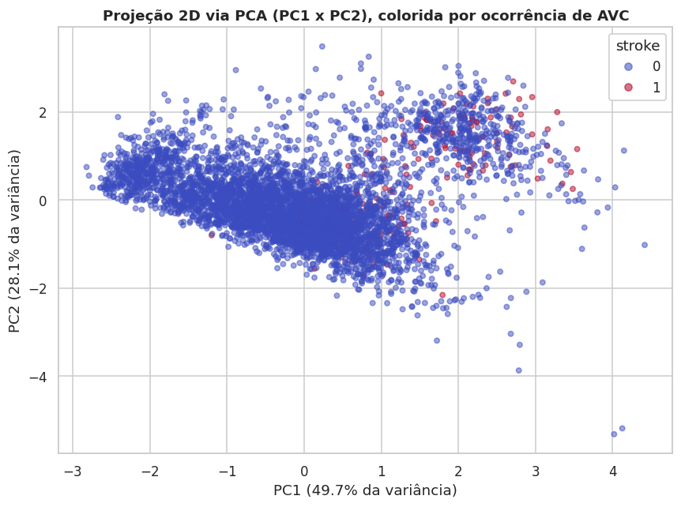
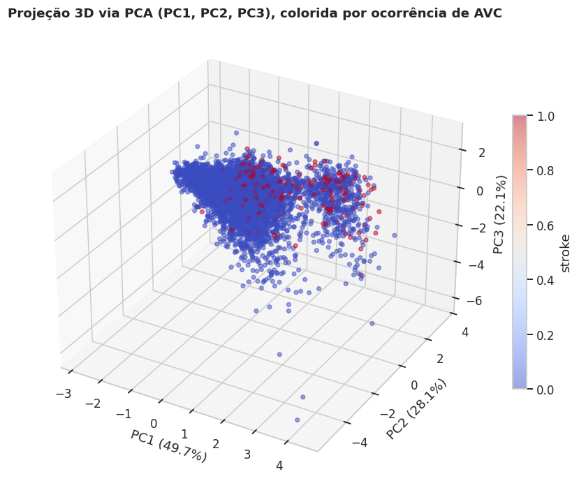

# Redução de Dimensionalidade (PCA)

Aplicamos a **Análise de Componentes Principais (PCA)** sobre as variáveis numéricas padronizadas (`age`, `avg_glucose_level`, `bmi`), com o objetivo de visualizar a estrutura dos dados em 2 e 3 dimensões e avaliar visualmente a separabilidade entre pacientes com e sem AVC.

Como o PCA é sensível à escala, e como não podemos usar informação do conjunto de teste nesta etapa exploratória (para não antecipar decisões que pertencem ao pipeline final), o PCA aqui é aplicado **apenas para fins de visualização/diagnóstico exploratório** sobre o dataset completo. A versão "oficial", sem *data leakage*, é reaplicada dentro do `Pipeline`/`ColumnTransformer` — ver [Pipeline de Pré-processamento](pipeline.md) — ajustada somente no conjunto de treino.

```python
# Imputação simples (mediana) apenas para viabilizar a visualização exploratória do PCA
X_num = df[["age", "avg_glucose_level", "bmi"]].copy()
X_num["bmi"] = X_num["bmi"].fillna(X_num["bmi"].median())

# Padronização (obrigatória antes do PCA, pois as variáveis têm escalas muito diferentes)
scaler_viz = StandardScaler()
X_num_scaled = scaler_viz.fit_transform(X_num)

pca = PCA(n_components=3, random_state=42)
X_pca = pca.fit_transform(X_num_scaled)
```

## Variância Explicada

| Componente | Variância explicada | Variância acumulada |
|---|---:|---:|
| PC1 | 49,74% | 49,74% |
| PC2 | 28,14% | 77,88% |
| PC3 | 22,12% | 100,00% |



As duas primeiras componentes (PC1 e PC2) juntas já explicam quase 78% da variância acumulada entre as 3 variáveis numéricas — o que era esperado, já que partimos de apenas 3 features; o ganho de compressão do PCA aqui é modesto, mas ainda útil para visualização.

## Projeção 2D e 3D

```python
plt.scatter(X_pca[:, 0], X_pca[:, 1], c=df["stroke"], cmap="coolwarm", alpha=0.5)
```





## Cargas (Loadings)

| Variável | PC1 | PC2 | PC3 |
|---|---:|---:|---:|
| `age` | 0,632 | -0,175 | 0,755 |
| `avg_glucose_level` | 0,505 | 0,832 | -0,230 |
| `bmi` | 0,588 | -0,527 | -0,614 |

`age` e `avg_glucose_level` são as variáveis que mais contribuem para PC1, enquanto `bmi` tem peso mais relevante em PC2/PC3 — ou seja, PC1 funciona aproximadamente como um "eixo de risco metabólico/etário".

## Interpretação

No scatter 2D/3D, os pontos que representam casos de AVC (`stroke = 1`) não formam um cluster isolado: eles se **sobrepõem consideravelmente** à nuvem de pontos sem AVC, mas tendem a se concentrar em valores mais altos de PC1 — coerente com a associação já observada entre idade/glicose elevadas e maior risco de AVC.

Essa sobreposição indica que **as classes não são linearmente separáveis apenas com as 3 variáveis numéricas**.
