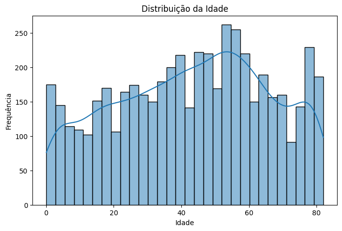
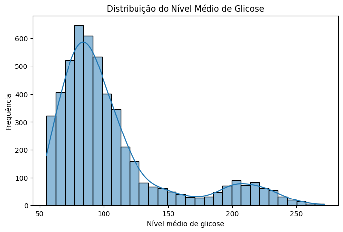
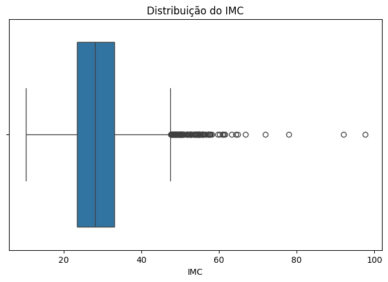
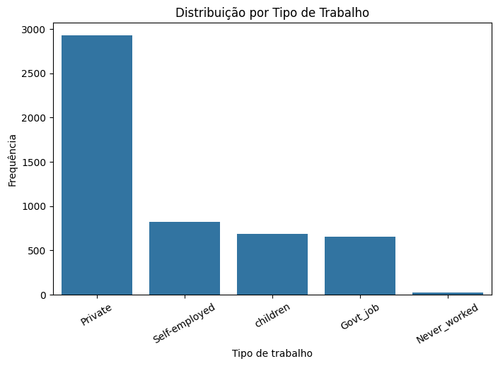
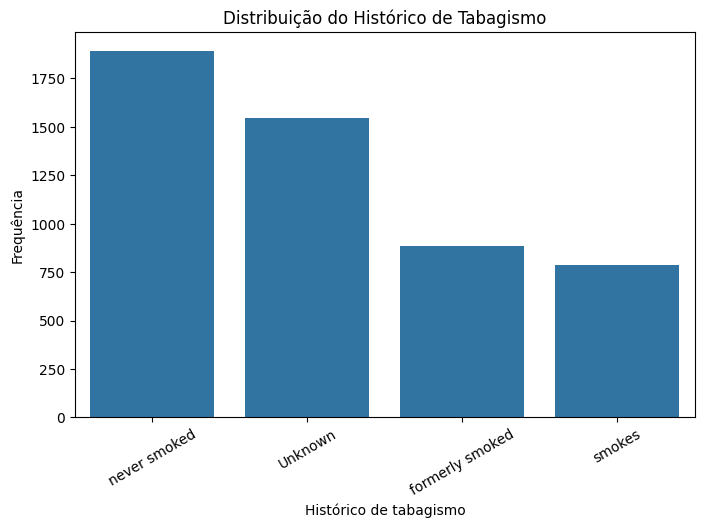
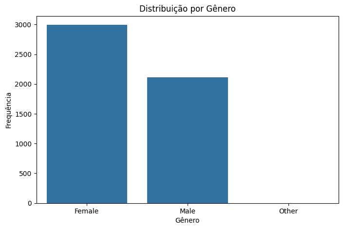

# Análise Univariada

A análise univariada busca compreender individualmente a distribuição e as principais características das variáveis do dataset.

## Variáveis Numéricas

Foram consideradas como variáveis numéricas quantitativas `age`, `avg_glucose_level` e `bmi`. As colunas binárias e a variável `id` não foram incluídas nesta análise, pois não representam medidas quantitativas contínuas.

### Estatísticas Descritivas

```python
numericas = ["age", "avg_glucose_level", "bmi"]

df[numericas].describe()
```

| Estatística | `age` | `avg_glucose_level` | `bmi` |
|---|---:|---:|---:|
| Média | 43,23 | 106,15 | 28,89 |
| Mediana | 45,00 | 91,89 | 28,10 |
| Desvio padrão | 22,61 | 45,28 | 7,85 |
| Mínimo | 0,08 | 55,12 | 10,30 |
| 1º quartil (25%) | 25,00 | 77,25 | 23,50 |
| 3º quartil (75%) | 61,00 | 114,09 | 33,10 |
| Máximo | 82,00 | 271,74 | 97,60 |

A variável `age` apresenta média de **43,23 anos** e mediana de **45 anos**, com valores distribuídos entre 0,08 e 82 anos.

Em `avg_glucose_level`, a média (**106,15**) é superior à mediana (**91,89**), além de o valor máximo (**271,74**) estar consideravelmente distante do terceiro quartil (**114,09**). Esses resultados sugerem uma possível assimetria à direita, investigada visualmente a seguir.

Para `bmi`, a média (**28,89**) e a mediana (**28,10**) são próximas. Entretanto, o valor máximo de **97,60** está bastante acima do terceiro quartil (**33,10**), indicando a possível presença de valores extremos.

A existência de possíveis outliers não implica que essas observações sejam incorretas. Sua distribuição deve ser analisada antes de qualquer decisão de tratamento.

### Distribuição da Idade

```python
sns.histplot(data=df, x="age", bins=30, kde=True)
```



A variável `age` apresenta uma distribuição ampla, abrangendo desde indivíduos com menos de um ano até 82 anos. Observa-se maior concentração de indivíduos adultos e de meia-idade, especialmente na faixa aproximada entre 40 e 60 anos.

A média de **43,23 anos** e a mediana de **45 anos** são relativamente próximas, embora a distribuição visual não apresente formato perfeitamente simétrico ou normal.

### Distribuição do Nível Médio de Glicose

```python
sns.histplot(data=df, x="avg_glucose_level", bins=30, kde=True)
```



A variável `avg_glucose_level` apresenta uma distribuição **assimétrica à direita**, com maior concentração de observações aproximadamente entre 70 e 110. Também é possível observar um segundo agrupamento, menos frequente, em valores próximos de 200.

Essa assimetria é consistente com as estatísticas descritivas, nas quais a média (**106,15**) é superior à mediana (**91,89**). Além disso, a distribuição se estende até o valor máximo de **271,74**, indicando a presença de valores elevados que merecem atenção na análise de possíveis outliers.

### Distribuição do IMC

Para complementar a análise do `bmi`, foi utilizado um boxplot, permitindo visualizar a dispersão dos dados e possíveis valores extremos.

```python
sns.boxplot(data=df, x="bmi")
```



O `bmi` apresenta mediana de **28,10** e a maior parte dos valores está concentrada em uma faixa relativamente estreita. Entretanto, o boxplot evidencia diversos valores extremos na parte superior da distribuição, alguns chegando próximos ao máximo de **97,60**.

Esses valores são considerados possíveis outliers pelo critério visual do boxplot, mas não podem ser classificados automaticamente como erros. Por isso, seu tratamento deverá ser avaliado posteriormente na etapa de pré-processamento.

## Variáveis Categóricas

Para as variáveis categóricas, foram calculadas as frequências de cada categoria. Três variáveis foram selecionadas para representação gráfica: `work_type`, `smoking_status` e `gender`.

```python
categoricas = ["work_type", "smoking_status", "gender"]

for coluna in categoricas:
    print(f"\n{coluna}")
    print(df[coluna].value_counts())
```

### Tipo de Trabalho

```python
sns.countplot(
    data=df,
    x="work_type",
    order=df["work_type"].value_counts().index
)
```



A variável `work_type` apresenta uma distribuição desigual entre suas categorias. A categoria `Private` é predominante, com **2.925 indivíduos**, seguida por `Self-employed` (819), `children` (687) e `Govt_job` (657).

A categoria `Never_worked` é pouco frequente, aparecendo em apenas **22 observações**. Essa baixa representatividade deve ser considerada posteriormente, especialmente ao analisar relações entre `work_type` e a ocorrência de AVC.

### Histórico de Tabagismo

```python
sns.countplot(
    data=df,
    x="smoking_status",
    order=df["smoking_status"].value_counts().index
)
```



A categoria `never smoked` é a mais frequente, com **1.892 observações**, seguida por `Unknown`, com **1.544 registros**. As categorias `formerly smoked` e `smokes` apresentam, respectivamente, 885 e 789 observações.

Destaca-se a elevada frequência da categoria `Unknown`, que representa indivíduos cujo histórico de tabagismo não é conhecido. Embora não seja registrada como um valor ausente (`NaN`), essa categoria representa informação indisponível e deverá ser considerada nas decisões de pré-processamento.

### Distribuição por Gênero

```python
sns.countplot(
    data=df,
    x="gender",
    order=df["gender"].value_counts().index
)
```



A variável `gender` apresenta predominância da categoria `Female`, com **2.994 observações**, seguida por `Male`, com **2.115**.

A categoria `Other` aparece em apenas **uma observação**, sendo extremamente rara no conjunto de dados. Essa baixa representatividade deverá ser considerada posteriormente durante o pré-processamento.